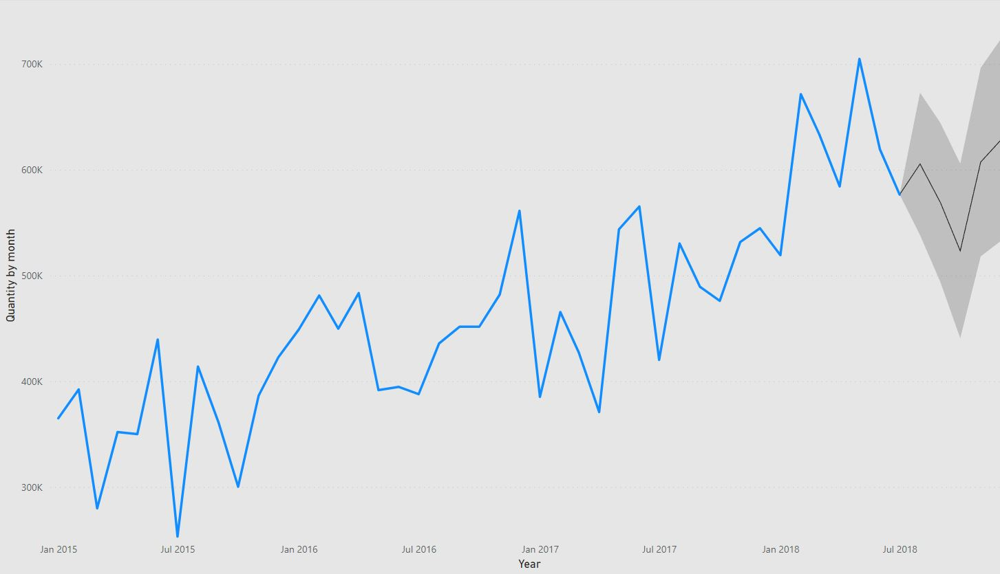

# Követelmények, Technológiák, Tech stack

Kutatásunk elvégzéséhez első körben szükségünk volt egy felületre, ahol képesek voltunk kollaborálni és megosztani munkáinkat, továbbá tárolni minden fontos dokumentumot a kutatással kapcsolatban. Ugyanakkor kellett egy vagy több csatorna is, ahol tartani tudtuk a kapcsolatot egymással és konzulensünkkel.

### [Power BI Service](https://powerbi.microsoft.com/hu-hu/)

Ez a platform volt az egyik jelentős adattárolási szerepet betöltő eszközünk, mivel nem csak interaktív report szerkesztési és bővítési lehetőségek álltak rendelkezésünkre, hanem ide kerültek közzé tételre az egyes reportok, datasettek és kerültek létrehozásra a dataflow-jaink. Azure Active Directory tenant-on keresztül kaptunk hozzáférést, amelyet konzulensünk bocsájtott rendelkezésünkre.

### [GitHub](https://github.com/)

A GitHub egy hosting platform verziókövetéshez és kollaborációhoz. Mindent, ami a kutatással kapcsolatban szükséges volt (adatok, dokumentáció, reportok, weboldal), az ide került feltöltésre. Ennek elérésére egy repository-ra volt szükségünk, amit az egyetem biztosította számunkra.

### [Microsoft Teams](https://www.microsoft.com/hu-hu/microsoft-teams/log-in)

A Teams a folyamatos kapcsolattartás miatt került be listánkba, mivel a heti meetingjeink konzulensünkkel itt zajlottak, továbbá itt is tartottunk külön meetingeket és hoztunk létre külön csoportot, ahol szintén a témával kapcsolatos információkat osztottunk meg egymással.

### [Discord](https://discord.com/)

A Discord egy ingyenes VoIP alkalmazás, amelynek segítségével szintén képesek voltunk az online térben találkozni és ott is meetingelni. Az egyik nagy előny az volt, hogy egyszerre többen is oszthattunk meg képernyőt.

### [Gmail](https://www.google.com/intl/hu/gmail/about/)

A Gmail a Google levelező szolgáltatása, amit mi többnyire meetingjeink ütemezésére használtunk, továbbá konzulensünkkel való kapcsolattartásra.

## Kutatómunka elvégzéséhez használt technológiák

### [Power BI Desktop](https://powerbi.microsoft.com/en-us/desktop/)

Szoftver verziószáma: 2.100.1401.0 (64 bit)

## AutoML követelmények

## R követelmények

## Python követelmények

# Munkamenet és -felosztás

A munkamenet általánosan heti meetingeken került egyeztetésre külső konzulensünk, Edelényi Márton jelenlétében. Ezen felül a csoporttagok között tartottunk még meetingeket, általában legalább heti egyet, hogy egyeztessük ki hogyan áll és ki milyen problémákba futott bele, észrevételek egyeztetésére, továbbá hogy képesek legyünk olyan dolgokat is észre venni, amelyeket egyedül nem tudnánk. Kutatásunk hétről hétre bővült, folyamatos egyeztetések és ellenőrzések útján. Az első feladatunk az információgyűjtés volt, ami eleinte a Power BI-ra fókuszált.

Azért, hogy kiismerjük magunkat a Power BI nyújtotta lehetőségek között, szükségünk volt az alábbiak ismeretére:

- Power BI Desktop működése
- Power BI Service működése
- Licensz típusok és azok ismérvei
- Munkafolyamatok

Ezt követően elkezdtünk a Machine Learning, azaz gépi tanulás területével foglalkozni, ehhez az alábbi koncepciókat tanulmányoztuk:

- Adatelőkészítési ismeretek
- Forecast (előrejelzés) fogalma és ismerete
- Classification (osztályozás) fogalma és ismerete

Ahhoz, hogy ki tudjunk próbálni mindent, amit elsajátítottunk, konzulensünk rendelkezésünkre bocsájtott hozzáféréseket egy Azure Active Directory tenant (bérlő) keretein belül, így képesek voltunk a kapott fiókok segítségével a Power BI-hoz Servicen is kollaborálni és megosztani, továbbá Desktopon készített reportjainkat is közzé tenni a felhőben.
A kezdeti, információgyűjtő fázis után közösen meghoztuk a döntést arról, hogy a kutatás milyen irányokba mozduljon el, milyen lehetőségeket vizsgáljunk meg és milyen mélységben.

## Irány kijelölése, munka felosztása

Figyelembe véve, hogy a munka egy egyetemi félév hosszára korlátozódik, a csoport három főből áll, alapvető statisztikai ismeretekkel rendelkezünk és a kutatás területe önmagában rendkívül tág mind horizontálisan mind vertikálisan, így az a döntés született, hogy inkább a horizontális feltérképzésre koncentrálunk:

- Igyekszünk minél több lehetséges AI megoldást keresni a Power BI-jal való ötvözésre
- Alapvető Machine Learning megoldásokat alkalmazunk, amelyek célja a megvalósíthatóság vizsgálata a Power BI-on belül
- Összehasonlítjuk a különböző lehetőségeket
- Összefoglaljuk kutatásunk egy demo keretein belül
- Dokumentáljuk eredményeinket

### A kutatás mérföldkövei

- Megfelelő adathalmazok keresése a különböző feladatokhoz és demohoz
- Technológiák kiválasztása és felosztása egymás között
- Mini projektek megvalósítása személyenként
- Osztályozási probléma megoldása
- Előrejelzési probléma megoldása
- Egyéni összesítés készítése személyenként előre meghatározott szempontok szerint
- Összesítő táblázat készítése a rendelkezésre álló információkból
- Demo készítése az összes kutatott technológia segítségével
- Dokumentáció készítése

### Az időbeosztás

Kutatás teljes időtartama: 15 hét

Kezdés dátuma: 2021. október 14.

Befejezés dátuma: 2022. január 26.

Heti rendszerességű meetingjeink során mindig egy héttel előre határoztuk meg a feladatokat és hogy ki-mit csináljon, ugyanakkor nagy vonalakban rendelkeztünk egy vázlatos ütemtervvel, hogy körülbelül mikor-mit kell elvégezni és mire mennyi idő áll rendelkezésre.
Alapvetően a következő volt az idő felbontása vázlatosan:

- Technológiák megismerése, tanulási szakasz - 2021. október
  - Októberben tartottuk első meetingünket és már az első meeting előtt közölt, szükséges Power BI ismeretek tanulmányozása, majd teszt reportok készítése, ML alap koncepcióinak elsajátítása volt a feladat, így erre hónapra nem terveztünk előre. A hónap végén határoztuk meg a haladás irányát és a projekt célját.
- Mini projektek és összehasonlító táblázat - 2021. november
  - november első hete: dataset kiválasztása a problémákhoz, összehasonlítási szempontok lefektetése
  - november második hete: előrejelzési és osztályozási feladat megvalósítása
  - november harmadik hete: egyéni kiértékelés
  - november negyedik hete: csoportos, összesítő táblázat elkészítése
- Demo és dokumentáció - 2021. december - 2022. január
  - A demo készítésre, a projekt lezárására és dokumentálásra jelöltük ki a hátralévő időkeretet.

### A munka felosztása

A munkák felosztását úgy oldottuk meg, hogy Machine Learning megoldásonként bontottuk fel csoportunkat, így voltak közös munkáink és önállóak is egyaránt. Az egyéni munkák során felmerülő komplikációkat és észrevételeket megosztottuk egymással a jobb hatékonyság érdekében, továbbá a külön csoport meetingjeinek aktívan segítettünk egymásnak egy-egy adott feladattal kapcsolatos probléma megoldásában.

Az első szakaszban kimondottan közös munkáról beszélhetünk. Ekkor igyekeztünk csoport szinten utána járni mindennek, ami kapcsolódhat a Power BI-hoz és a Machine Learning alapjaihoz. Később az adathalmazokat is közösen kerestük, majd együtt kiválasztva a legjobbakat haladtunk tovább az egyéni feladatokra.

Békési Andor feladata volt a beépített Machine Learning lehetőség, az AutoML megismerése, alkalmazása és értékelése. Janoschek Balázs és Kakas Ádám pedig a két alternatív megoldásért feleltek, amelyek script alapúak: R és Python Machine Learning megvalósítása különböző külső könyvtárak alkalmazásának segítségével. Ezt követően mindenki kiértékelte előre egyeztetett szempontok alapján megoldásait, amit pedig végül egy közös táblázatban összegeztünk.

A munka utolsó szakaszán a demo elkészítése során kiválasztottunk egy olyan adathalmazt, amelyen mindkét (osztályozási és előrejelzési) feladat elvégezhető egyaránt. Külön készítettük el megoldásainkat, majd közösen megbeszéltük és javítottuk azok esetleges problémáit és összesítettük őket a Power BI Serviceben.

## Mini projektek

Mini projektjeink során egyénileg oldottuk meg a Machine Learning-gel kapcsolatos feladatokat a különböző technológiák segítségével. Miután létrehozásra került a dataflow, egy számunkra megfelelő adatsort kellett keresni, amelyen dolgozni lehet. Többféle adatsort tekintettünk meg, végül kiejtettük azokat, amik különböző okokból nem voltak alkalmasak a megfelelő predikciók elkészítéséhez.

### Osztályozási feladat

Bináris osztályozás estében egy adott tulajdonságot (függő változó) prediktálunk a modell segítségével, más, előre kiválasztott tulajdonsághalmaz (független változók) alapján. Az algoritmus betanítása után képes egy, a modellhez használt tulajdonsághalmazzal rendelkező adatsorról predikciót készíteni, aminek eredménye egy pozitív és negatív osztályra bontott sorozat. A kimenetel annak függvényében változik, hogy a függő és független változók kapcsolata mennyire erős. Fontos szempont a független változók száma, mivel itt általában komplexebb összefüggéseket keresünk, ugyanakkor a túl sok szempont kiválasztása során a modell már nem fog összefüggéseket találni.

Szintén figyelni kell arra, hogy a kiválasztott tulajdonság besorolása négy féleképpen végződhet:

- True positive (az a kimenetel, ahol a modell jól becsüli meg a pozitív osztályt)
- False positive (az a kimenetel, ahol a modell rosszul becsüli meg a pozitív osztályt)
- True negative (az a kimenetel, ahol a modell jól becsüli meg a negatív osztályt)
- False negative (az a kimenetel, ahol a modell rosszul becsüli meg a negatív osztályt)

A dataseteket olyan szempontok szerint válogattuk ki, mint például, hogy mennyi adat állt rendelkezésre, észlelhető valamilyen mintázat, periodikusság az adatsorban, megfelelő számú attribútum áll-e rendelkezésre és az attribútumok között észlelhetőek-e kapcsolatok. Így esett a választásunk a [kerékpár eladások](https://github.com/BlueGranite/AI-in-a-Day/tree/master/AutoML)at tároló adatforrásra.

### Előrejelzési feladat

Jövőbe mutató predikció készítése során historikus adatok felhasználásával egy adott tulajdonság jövőbeli alakulását becsültettük meg algoritmusaink segítségével, amelyek eredménye egy-egy sorozat. A folyamat úgy zajlik, hogy a kiválasztott tulajdonság alapján becslést készít a modell, amihez megvizsgálja az adatok szezonalitását, trendjét, és a fennmaradó maradék részt majd ezt követően adott időtávra készít becslést.

Fontos szempont, hogy minél nagyobb időtávot figyelünk annál nagyobb a tévesztés és pontatlanság esélye, így túl nagy időtávokat nem érdemes figyelni. Továbbá adataink periodikusságának függvényében érdemes az időtávot kijelölni.

Az előrejelzési feladathoz felhasznált forrásunk [repülési adatok](https://www.kaggle.com/rakannimer/air-passengers)ból tevődött össze.

## Integrációs lehetőségek és a modell vizsgálata

Szintén egy nagyon fontos rész az integrációs lehetőségek és a modellek vizsgálata, mivel megoldásaink nem feltétlenül garantálják annak a Power BI teljes rendszerével (Desktop és Service) való teljes integrálhatóságát és hozzáférhetőségét, így ezeket ki kellett vizsgálnunk.

Az alábbi szempontok szerint értékeltük a megoldásokat:

### Létrehozás, elérhetőség és menthetőség

Az AutoML használatához mindenképpen Power BI Serviceben kell létrehoznunk modellünket egy adott workspace-en belül, míg ezzel szemben az alternatív megoldásaink csak Desktopon beilleszthetőek. Scriptekkel létrehozott modelljeink mentésére nincs lehetőségünk, Applied Steps formájában kerülnek elmentésre az összes többi módosítással egyetemben, amit az adatokon végeztünk azok átalakításakor (ETL folyamat) a Power Query Editorban. Ennek következtében az adatok frissülésekor újra lefutnak a többi lépés mellett, így noha beszélhetünk egyfajta frissülésről és menthetőségről, ugyanakkor korlátokba ütközünk, hiszen ezt a megoldást nem tudjuk egy másik, külső adathalmazon lefuttatni, amit mondjuk szintén a Service adott workspace-ében tárolunk. Az AutoML esetében a modell a felhőben érhető el és menthető oda továbbra is, továbbá alkalmazható nem csak a forrásfájlon.

### Frissíthetőség

Az ütemezett frissítés lehetősége korlátozottan érhető el scriptek esetében: kizárólag personal data gateway segítségével tudunk ütemezetten frissíteni az adatainkon, amelyek Python vagy R scriptet használnak, mindezt úgy, hogy mind adatainknak, mind a Pythonnak / R-nek "nyilvános" beállításon kell lenniük a hitelesítés során, továbbá állandónak kell lennie a kapcsolatnak az ütemezett frissítésekhez. Ehhez értelemszerűen a personal gateway-jel rendelkező számítógépnek folyamatosan üzemelnie kell és állandó internetkapcsolat is szükséges. Természetesen a manuális megoldás, miszerint letöltjük a reportot és lokálisan módosítunk, majd frissítünk elérhető továbbra is.

Sajnos nem teljesen egyértelmű ebben az esetben az AutoML működése, mivel a feltrainelt modell nem frissül, ha annak input táblája frissül, ugyanakkor, ha a modell adatfolyamát Power Query Editorral nyitjuk meg és módosítjuk, akkor pedig igen. Szintén fontos megemlíteni, hogy a predikcióink a beépített lehetőség esetén automatikusan nem frissülnek, ha azok adatai igen.

### Külső integrációs lehetőségek

A beépített megoldás rendelkezik kettő Microsoftos integrációval:

- [Cognitive Services](https://azure.microsoft.com/hu-hu/services/cognitive-services/)
- [Azure Machine Learning Integration](https://docs.microsoft.com/en-us/azure/machine-learning/)

A scriptelés oldaláról az alábbi megkötések érvényesek ránk:

- [Python](https://docs.microsoft.com/en-us/power-bi/connect-data/service-python-packages-support)
- [R](https://docs.microsoft.com/en-us/power-bi/connect-data/service-r-packages-support)

Ugyanakkor fontos megjegyezni, hogy az adatok beolvasása történhet egy előzetesen módosított script feldolgozással is, tehát több munkával, de kiterjeszthető az integráció más script könyvtárakra is.

Megjegyzés: a scriptekhez tartozó linkek vizualizációval kapcsolatosak, egyértelmű kijelentést nem találtunk többszörös keresés után sem arról, hogy a Power BI Query Editorjában található Python és R scriptelési lehetőség, amit mi is első helyen használtunk munkánk során, rendelkezik-e hasonló limitációkkal.

## Demo

A kutatás végét szerettük volna egy olyan bemutatóval zárni, ami betekintést enged a különböző alkalmazott technológiák eredményeibe kicsit interaktívabb formában. Ezért a Power BI Serviceben készítettünk egy közös Dashboardot, amin megtekinthetőek az egyes megoldások, továbbá egy beépített forecast lehetőség bemutatása is.

