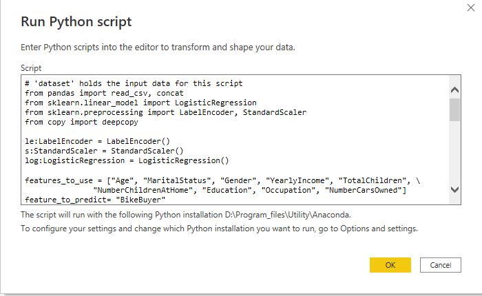
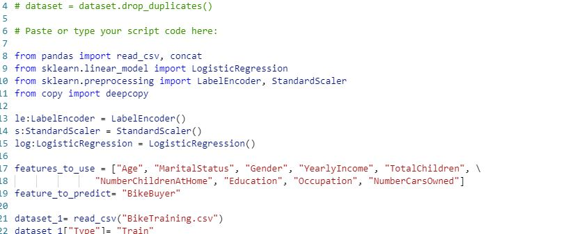

# Python dokumentáció

A dokumentáció ezen részében kitérünk az alábbiakra:

- editorok és szükséges lépések
- Python szükséges lépések
- bináris osztályozás scikit-learn könyvtárral
- előrejelzés statsmodels könyvtárral

## Editorok

A kutatás során 3 editorral találkoztunk, amikor Pythonnal dolgoztunk.

Ebből a legfontosabb számunkra a [Visual Studio Code](https://code.visualstudio.com/) volt, amit mi választottunk, hiszen itt volt a legoptimálisabb a munka elvégzése. Ahhoz, hogy a Python-t a lehető legjobb keretek között szerkeszthessük telepítenünk kell egy [extensiont](https://marketplace.visualstudio.com/items?itemName=ms-python.python), amit az applikációból kényelmesen meg tudunk tenni. Természetesen egyéb extension-öket is telepíthetünk, viszont mi az egyszerűség kedvéért ezt válaszottuk.

Azért, mert a Power BI transformációs script editora egy-az-egyben kéri a scriptet, így nem történt kód kiszervezés sem. Minden egyes scriptet egy-egy fájlban írtunk meg, majd tartalmukat átmásoltuk. Fontos megjegyezni, hogy az itt megírt adat importjainkat (CSV, Excel, stb.), amikkel teszteljük mondelljeink helyességét, feltétlenül vegyük ki a Power BI Desktop-ba illesztett editorból, mivel az alkalmazás rendelkezésünkre bocsájtja az adatokat egy 'dataset' nevű Pandas DataFrame fromájában.

A képen jól látható, hogy a beépített Power BI editor nem igazán biztosít sok lehetőséget, ugyanakkor ez áll egyedül rendelkezésünkre, de ez nem is probléma, hiszen ezért választottunk eleinte egy külön editort erre a feladatra. Még egy alternatívánk a vizuális scriptek editora, ami már rendelkezik ugyan egy részleges syntax highlight-tal, ugyanakkor nincs automatikus kódkiegészítés, lintelés, továbbá munkánk során ezt a lehetőséget azért sem használtuk, mert nem itt illesztettük be gépi tanulási modelljeink kódját.

## Python szükséges lépések

Első lépésként aktiváljuk Power BI-ban a script lehetőséget és mutassunk rá a Python-t tartalmazó könyvtárra, ez a mi esetünkben az Anaconda gyökér könyvtára lesz.

Ahhoz, hogy a Power BI érzékelje Python-unkat és ne dobjon hibát kód futtatásakor, szükséges az alábbi környezeti változókat beállítanunk, amennyiben Anaconda disztribúciót használunk.

Ez sajnos nem dokumentált lépés és nem is javított probléma, ugyanakkor az alábbi [link](https://community.powerbi.com/t5/Desktop/Microsoft-PowerBI-Scripting-Python-Exceptions/td-p/850714) segítségével oldottuk meg mi is a problémát.

## Bináris osztályozás

A feladat megvalósításához két tábla adatait használtuk fel, amelyek bicikli eladásokat vizsgálnak. Munkánk során arra próbálunk becslést tenni, hogy vajon hányan vásárolnak biciklit és milyen a vásárlók és nem vásárlók aránya.

Az itt használt tábláink:

- BikeTraining.csv
- ProspectiveBuyer.csv

[Link a fájlokhoz](https://github.com/BlueGranite/AI-in-a-Day/tree/master/AutoML)

### Power BI műveletek

Mivel modellünket csak helyben tudtuk alkalmazni, így a train táblát és a test táblát konkatenálnunk kellett. (A másik megoldás az lett volna, ha egy fájlból húzzuk be az összes adatunkat.)

Az adatimport lépése során arra kell odafigyelnünk, hogy minden adat a megfelelő adattípusú legyen, ezért muszáj először ezt ellenőriznünk és javítanunk, ahol szükséges.

Módosított oszlopok listája a táblákban:

- Text -> Egész szám átalakítás
  - YearlyIncome
  - Age
  - NumberChildrenAtHome
  - NumberCarsOwned
  - TotalChildren

Az ide betöltött táblákhoz a típusok ellenőrzése után hozzáadtunk 1-1 új oszlopot 'Type' névvel, hogy meg tudjuk különböztetni a két táblát egymástól az összevonás után is. Míg modelltanításra szánt táblánk a 'Train' értéket kapta, úgy a teszteléshez szánt pedig a 'Test' értéket.

Ezek után összevontuk tábláinkat, amiken már képesek voltunk a script futtatására.

Az így kapott táblával már képesek vagyunk a script futtatására.

### Python műveletek

A bináris osztályozási feladat során a scikit-learn könyvtárral dolgoztunk.

Ezután érdemes a később használt objektumokat egyben deklarálni, bár ez ízlés kérdése, mi inkább a kód elejére tettük őket a becslés során használt függő és független tulajdonságokkal egyetemben.

Ezek után a helyben való tesztelhetőség érdekében célszerű az adatinkat beolvasni olyan formában, ahogy a Power BI is szolgáltatná nekünk egy nagy dataset formájában, majd szétszedni azt azon oszlop alapján, amit a Power BI-ban meghatároztunk az adattranszformációs lépésben. Szintén fontos kijelölni előre egy datasetet, amit visszaadunk majd a folyamat végén, mivel a modellhez át kell majd alakítanunk a kezdeti datasetjeinket. Itt deepcopy-t használtuk a copy modulból, amit nem kell külön telepítenünk, mivel a Python Lib könyvtárában megtalálható. Erre azért volt szükség, mivel amikor egy dataset részét kivesszük, akkor az referenciával rendelkezik az eredeti dataset-re, mi pedig ezt el szeretnénk kerülni az átalakítások miatt.

Ezután áttérünk az átalakításokra, amihez a [LabelEncoder](https://scikit-learn.org/stable/modules/generated/sklearn.preprocessing.LabelEncoder.html) osztályt és a [StandardScaler](https://scikit-learn.org/stable/modules/generated/sklearn.preprocessing.StandardScaler.html) osztályt használtuk fel. Míg előbbi abban segít nekünk, hogy azon oszlopainkat, amelyek nem számformátumúak, számmá konvertálja, addig utóbbi a normalizálásban / standardizálásban segít. Az elsőre azért van szükség, mert az átalakítások és számítások során számokra van szükségünk a munkához, mint például amikor a StandardScaler objektumunk normalizálja az értékeket.

A korábbi szétválogatás miatt viszont szükséges végig mennünk mindkettő DataFrame-en, ahhoz, hogy képesek legyünk független változóinkat tartalmazó oszlopainkon végigiterálni. Ezt követően már normalizálhatjuk is azokat. Figyeljük meg, hogy a függő változónkat tartalmazó oszlophoz nem nyúltunk, így azok értékei változatlanul maradnak azokon az értékeken, amiken alapvetően voltak.

A képen továbbá látszik az is, hogy inicializáltuk [LogisticRegression](https://scikit-learn.org/stable/modules/generated/sklearn.linear_model.LogisticRegression.html) modellünket, amit előbb a train adatokkal betanítunk, majd pedig az átalakított test adatokon alkalmazzuk.

Eredményünk az a DataFrame objektum ('resultset'), amit feljebb inicializáltunk a test adatsor azon oszlopaival, amelyek a predikcióban részt vettek, kibővítve azzal a sorozattal, amit a predikció szolgáltatott. Fontos megjegyezni, hogy a visszakapott objektum adatait ismét át kell alakítanunk, mivel azokra nincs hatással az előzetes típus módosítás, amikor scriptként átadásra kerülnek a Power BI-tól.

Eredményünk jobbra a becsléssel jött létre, míg balra pedig az eredeti adatsorból készített tortadiagram látható.

## Előrejelzés

Ehhez a feladathoz egy táblát használtunk, amely repülési adatokat tartalmaz 11 évről, havi bontásban. A feladat során azt próbáltuk megbecsülni, hogy hogyan alakul a repülések aránya az eredeti adatsort követő 6 hónapban. Összességében 18 hónapot vetítettünk előre, de korábbról indítottuk modellünket egy évvel, hogy annak eredménye a valósággal összehasonlítható legyen.

Az adatsor táblája [itt](https://www.kaggle.com/rakannimer/air-passengers) található meg.

### Power BI műveletek

Az adatok importálása után az adattranszformációs részen azt tapasztaltuk, hogy a Power BI jól meg tudta becsülni adataink típusát, így itt csupán annyit kell átállítanunk (bár ez inkább megszokás kérdése), hogy az adott hónap ne első, hanem utolsó napját vegyük minden esetben.

Ekkor duplikáltuk táblánkat, mivel a valós adatokra még szükségünk lesz, majd ezt követően hozzáadtunk a táblánkhoz egy új oszlopot 'Type' névvel, aminek értékül 'Real'-t adtunk. (Itt alkalmazhattunk volna tábla referenciát is.)

A duplikált táblában pedig a dátumra szűrést alkalmaztunk.

Scriptjeinket ettől a ponttól futtattuk.

### Python műveletek

A forecast feladat során a statsmodels könyvtár [Holtwinters' Exponential Smoothing](https://www.statsmodels.org/dev/generated/statsmodels.tsa.holtwinters.ExponentialSmoothing.html) modellét alkalmaztuk.

Itt definiáltunk egy függvény annak érdekében, hogy a [date_range](https://pandas.pydata.org/docs/reference/api/pandas.date_range.html) függvény eredményéül kapott DatetimeIndex-et abba a dátumformátumba hozzuk, amivel dolgozni szeretnénk a későbbiek folyamán. Ahhoz, hogy ugyanazokkal a dátumokkal dolgozzon modellünk, szükséges leszűrnünk eredeti datasetünket a kívánt dátumtartományra. Továbbra is érvényes az, hogy az itt beolvasott adatok csak a tesztelés lehetősége miatt vannak itt, a Power BI-ba való beillesztés pillanatában kivételre kerültek.

Ezt követően létrehoztuk modellünket, amely kiértékeléshez megkapta paraméterül:

- Az adatsor azon részét, amelyre becslést kívántunk készíteni
- Az inicializációs metódust, aminek alapértelmezetten a modell szerint becsült érték
- A trendet, ami leírja adatsorunk két dimenziós térben felvett irányát
- A szezonalitást, ami leírja adatsorunk időszakos ingadozásait
- Periódusok számát, amely meghatározza az adatok periodikusságát
- Boxcox transzformáció bekapcsolását, amely lehetővé teszi, hogy normalizáljuk adatsorunkat

Ezek után modellünk segítségével előre becsüljük az adatsor utolsó évének kezdetétől számítva az elkövetkező 18 hónap értékeit, majd a visszakapott értékeket kerekítjük.

Végül visszaadtuk egy DataFrame keretében a becslésünket és az ahhoz tartozó dátum intervallumot.

## Power BI műveletek 2

A visszakapott tábla oszlopait ellnőriztük, mivel előfordul, hogy nem megfelelő a típuskonverzió. Így is történt, így a kapott eredményoszlop értékeit egész számmá alakítottuk, majd beszúrtunk egy új oszlopot 'Type' névvel és 'Forecast' értékkel.

Végül pedig konkatenáltuk a két táblát, melynek eredményeképpen már képesek voltunk vizualizálni eredményünket és a meglévő adatokat egy grafikonon.

Az előrejelzés eredménye egy grafikonon:

